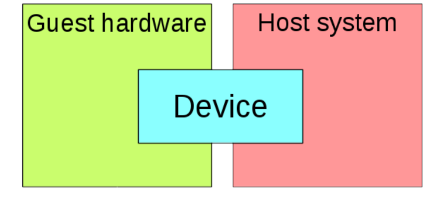

# Virtualization
## Introduction
In this lab we will use QEMU and KVM to build virtual machines.
QEMU is a userland type 2 (i.e runs upon a host OS) hypervisor for performing hardware virtualization, allowing code written for a given processor to be executed on another (i.e ARM on x86, or PPC on ARM).
Though QEMU can run on its own and emulate all of the virtual machine’s resources, as all the emulation is performed in software it is extremely slow.
KVM is a Linux kernel module.
It is a type 1 hypervisor that is a full virtualization solution for Linux on x86 hardware containing virtualization extensions (Intel VT or AMD-V).
But what is full virtualization, you may ask?
When a CPU is emulated (vCPU) by the hypervisor, the hypervisor has to translate the instructions meant for the vCPU to the physical CPU.
As you can imagine this has a massive performance impact.
To overcome this, modern processors support virtualization extensions, such as Intel VT-x and AMD-V.
These technologies provide the ability for a slice of the physical CPU to be directly mapped to the vCPU.
Therefore the instructions meant for the vCPU can be directly executed on the physical CPU slice.

## Setup
1. Clone this repository
```
git clone https://github.com/dragosargint/dcc_virtualisation_lab.git
```
2. Navigate into the cloned repo and download the following [filesystem](https://drive.google.com/file/d/1VcHDw1JEH-u3soOEJye1DxHCJgMbC-6c/view?usp=share_link)
3. TODO: Install deps

## Build a simple QEMU + KVM Virtual Machine
Let's see what we need to build a virtual machine.
First of all, we need a kernel image.
Secondly, we need a filesystem that contains the libraries part of the operating system.
And of course, we need a way to interact with the VM, so we can test it.
We have all these things at our disposal.
For this exercise, we will use the `alpine-bzImage` kernel image, which is simply the Linux kernel code compiled and linked in a compressed image.
And as a filesystem, we will use `simple_alpine_rootfs.ext4`.
This file is formatted with the ext4 filesystem layout.
The directory hierarchy and libraries for an Alpine distribution are already installed on it.

In order to start our virtual machine, we will have to give a series of parameters to Qemu.
First of all we are going to use the KVM accelerator and we are going to enable the KVM features for our cpu:
```
-enable-kvm -cpu host
```
Second of all we need to specify the amount of memory the guest is allowed to use:
```
-m 256M
```
And afterwards we can add I/O devices.
A good thing to bear in mind throughout the lab is that Qemu always uses 2 parts to emulate a device.
There's the guest (VM) hardware, which we are "emulating", and there's a backend in the host.
These two parts need to be linked together like in the following picture:

Let's use the `virtio-blk-pci` device for the Guest and let's use our `simple_alpine_rootfs.ext` as a backend for the host.
The arguments should be:
```
-device virtio-blk-pci,drive=id0 -blockdev file,node-name=id0,filename=simple_alpine_rootfs1.ext4
```
The string `id0` is how we link the device to the backend.
Let's also add a serial console to our guest:
```
-device isa-serial,chardev=serial0 -chardev socket,id=serial0,path=serial.socket,server,nowait
```
As earlier, the string `serial0` is the way we link our serial device on the guest to our backend in the host.
In this case the backed in the host will be an UNIX socket with the name `serial.socket`.
Let's put all the pieces toghether and start the VM:
```
qemu-system-x86_64 -enable-kvm \
        -cpu host \
        -m 256M \
        -kernel "alpine-bzImage" \
        -device virtio-blk-pci,drive=id0 -blockdev file,node-name=id0,filename=simple_alpine_rootfs1.ext4 \
        -device isa-serial,chardev=serial0 -chardev socket,id=serial0,path=serial.socket,server,nowait \
        -append "root=/dev/vda loglevel=15 console=hvc0"
```
If everything went well, we should see a qemu process running
```
pgrep qemu
```
Now let's connect to the serial using the unix socket.
You can use the `connect_to_socket.sh` as follows:
```
 ./connect_to_socket.sh /path/to/socket
```

# TODO: Add a network device to the VM

# TODO: Test e1000 driver vs virtio (add some scripts)

# TODO: GDB into the VM to see some intersting stuff (what's intersting to see?)

# TODO: UNIKRAFT VMs


## References
https://www.packetcoders.io/what-is-the-difference-between-qemu-and-kvm/
https://archive.fosdem.org/2018/schedule/event/vai_qemu_jungle/attachments/slides/2539/export/events/attachments/vai_qemu_jungle/slides/2539/qemu_cli_jungle.pdf