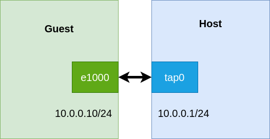
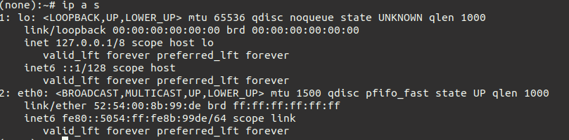
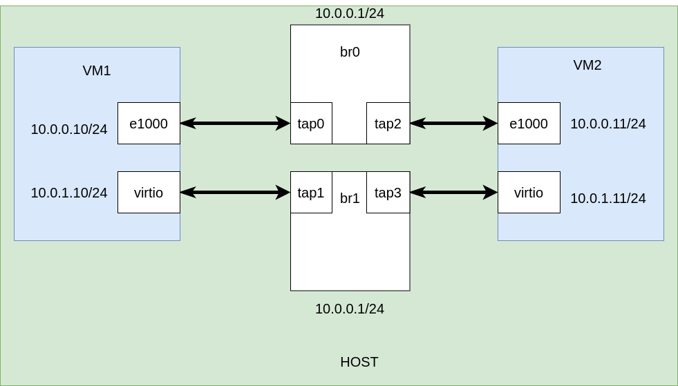
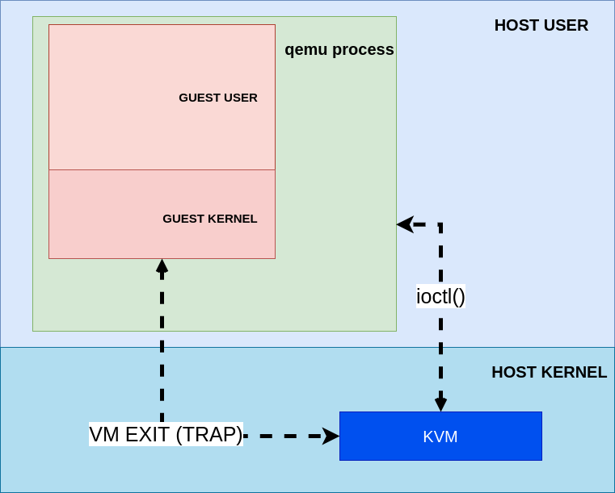
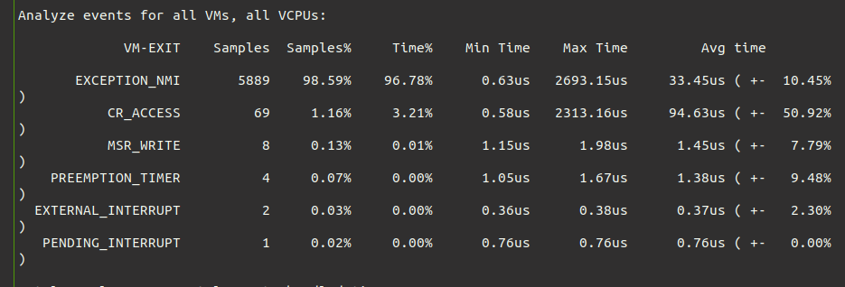

# Virtualization
## Introduction
This lab will be presented from a lower level perspective.
In this lab we will use QEMU and KVM to build virtual machines.
From the beginning it should be mentioned that there are all kinds of tools that abstract the operations we will do with qemu.
These can be libvirt or virtmanager.
But what is important to remember is that in the end it all comes down to qemu and kvm.
And although in production no one will create a virtual machine by writing thousands of arguments for qemu, it is useful to understand certain basic aspects related to virtualization.
QEMU is a userland type 2 (i.e runs upon a host OS) hypervisor for performing hardware virtualization, allowing code written for a given processor to be executed on another (i.e ARM on x86, or PPC on ARM).
Though QEMU can run on its own and emulate all of the virtual machine’s resources, as all the emulation is performed in software it is extremely slow.
KVM is a Linux kernel module.
It is a type 1 hypervisor that is a full virtualization solution for Linux on x86 hardware containing virtualization extensions (Intel VT or AMD-V).
But what is full virtualization, you may ask?
When a CPU is emulated (vCPU) by the hypervisor, the hypervisor has to translate the instructions meant for the vCPU to the physical CPU.
As you can imagine this has a massive performance impact.
To overcome this, modern processors support virtualization extensions, such as Intel VT-x and AMD-V.
These technologies provide the ability for a slice of the physical CPU to be directly mapped to the vCPU.
Therefore the instructions meant for the vCPU can be directly executed on the physical CPU slice.

## Setup
1. Clone this repository
```
git clone https://github.com/dragosargint/dcc_virtualisation_lab.git
```
2. Navigate into the cloned repo and download the following [filesystem](https://drive.google.com/drive/u/0/folders/1PqBOCx8IYmYaW6X46S6dB_lqeWRNMIJe)
3. Install the following deps:
```
sudo apt install qemu-system-x86
sudo apt install socat
sudo apt install bridge-utils
sudo apt install linux-tools-`uname -r`

```
4. Make sure KVM is supported
```
ls /dev/kvm
```

## Build a simple QEMU + KVM Virtual Machine
Let's see what we need to build a virtual machine.
First of all, we need a kernel image.
Secondly, we need a filesystem that contains the libraries part of the operating system.
And of course, we need a way to interact with the VM, so we can test it.
We have all these things at our disposal.
For this exercise, we will use the `alpine-bzImage` kernel image, which is simply the Linux kernel code compiled and linked in a compressed image.
And as a filesystem, we will use `simple_alpine_rootfs1.ext4`.
This file is formatted with the ext4 filesystem layout.
The directory hierarchy and libraries for an Alpine distribution are already installed on it.

In order to start our virtual machine, we will have to give a series of parameters to Qemu.
First of all we are going to use the KVM accelerator and we are going to enable the KVM features for our guest cpu:
```
-enable-kvm -cpu host
```
Second of all, we need to specify the amount of memory the guest is allowed to use. We will set it to 256MB:
```
-m 256M
```
Afterwards we can add I/O devices.
A good thing to bear in mind throughout the lab is that Qemu always uses 2 parts to emulate a device.
There's the guest (VM) hardware, which we are "emulating", and there's a backend in the host.
These two parts need to be linked together like in the following picture:


Let's use the `virtio-blk-pci` device for the Guest and let's use our `simple_alpine_rootfs1.ext4` as a backend for the host.
The arguments should be:
```
-device virtio-blk-pci,drive=id0 -blockdev file,node-name=id0,filename=simple_alpine_rootfs1.ext4
```
By using this command the VM will see a block device (i.e. Hard Disk). But there is no Hard Disk, in the back there's just a file.
The string `id0` is how we link the block device to the backend (i.e. our ext4 formatted file).

Let's also add a serial console to our guest:
```
-device isa-serial,chardev=serial0 -chardev socket,id=serial0,path=serial.socket,server,nowait
```
As earlier, the string `serial0` is the way we link our guest serial device to our backend in the host.
In this case the backed in the host will be an UNIX socket with the name `serial.socket`.
If you're not familiar with UNIX sockets imagine them as a pipe through which data can flow in both direction.

Let's put all the pieces toghether and start the VM.
Complete the `TODO` in `runqemu_single_vm.sh` with the following command:
```
qemu-system-x86_64 \
        -nodefaults \
        -nographic \
        -enable-kvm \
        -cpu host \
        -m 256M \
        -kernel "alpine-bzImage" \
        -device virtio-blk-pci,drive=id0 -blockdev file,node-name=id0,filename=simple_alpine_rootfs1.ext4 \
        -device isa-serial,chardev=serial0 -chardev socket,id=serial0,path=serial.socket,server,nowait \
        -append "root=/dev/vda loglevel=15 console=hvc0"
```
The `-nodefaults` and `-nographic` arguments tells qemu NOT to add any default devices like a screen.
Run the script
```
./runqemu_single_vm.sh
```
In another terminal, to see if everything went well, use the following command to see if the qemu process is running:
```
pgrep qemu
```
Now if you removed the `-nodefaults` and `-nographic` arguments, qemu might open a display for you and you can use that terminal to login with the credentials:
```
username: student
password: student
```
But this is not so intersting, after all we defined our own socket to connect to the VM.
Let's connect to the serial console using the unix socket.
You can use the `connect_to_socket.sh` script as follows:
```
 ./connect_to_socket.sh /path/to/socket
```
You must press a key to get the login prompt, and you can login with the student credentials, or with the root credentials directly:
```
username: root
password: toor
```
When getting a shell play around with some comands:
```
ls /
ip a s
```
When running the `ip` command you can see that we have only the loopback interface.
That's because we didn't specify any network device, and we will do that in the next exercise.

To close the unix socket, from another terminal run:
```
pkill socat
```
To kill the vm you can `CTRL+C` where you run `./run_qemu_single_vm` or, from another terminal, use:
```
pkill qemu
```

# Add a network device to the VM
So far we managed to start a VM and connect to it through the serial console.
Let's add a network device to it.
For the guest part, we will use an e1000 device, that is a network card that uses the e1000 driver.
For the host part we will use a `tap` interface.
See the image below:



Let's first create the backend (i.e. the `tap` interface).
To create a tap interface in Linux:
```
sudo ip tuntap add tap0 mode tap
sudo ip link set tap0 up
```
Let's also assign an ip address to it:
```
ip addr add 10.0.0.1/24 dev tap0
```
Now let's see how we can configure the guest device:
```
-device e1000,netdev=hostnet0,id=net0,mac=52:54:00:8b:99:de -netdev tap,ifname=tap0,id=hostnet0
```
As you can see we setup an e1000 device in the guest and we linked it to our host tap interface `tap0`.
We did that by specifing the string `hostnet0` (it can be any string as long as it is the same on both parts)
We also specified a mac address for the interface.
This is not mandatory as qemu could pick one up for us.
But when we are running multiple VMs we can end up with two VMs having the same mac address on their interfaces, and then
we cannot make them comunicate.
So, it's better if we specify it.

Let's go ahead and modify our `run_qemu_single_vm.sh` script to add the network interface:
```
qemu-system-x86_64 \
        -nodefaults \
        -nographic \
        -enable-kvm \
        -cpu host \
        -m 256M \
        -kernel "alpine-bzImage" \
        -device virtio-blk-pci,drive=id0 -blockdev file,node-name=id0,filename=simple_alpine_rootfs1.ext4 \
        -device isa-serial,chardev=serial0 -chardev socket,id=serial0,path=serial.socket,server,nowait \
        -device e1000,netdev=hostnet0,id=net0,mac=52:54:00:8b:99:de -netdev tap,ifname=tap0,id=hostnet0 \
        -append "root=/dev/vda loglevel=15 console=hvc0"
```
Run it and connect to the serial console as we did before.
Use the `ip a s` command to list the interfaces, you should see something like this:



Note that the mac address of the `eth0` interface is indeed what we specified.
Now let's set this interface up and assign an IP address to it:
```
ip link set eth0 up
ip addr add 10.0.0.10/24 dev eth0
```
If everything went well we should be able to ping our tap from inside the guest:
```
ping 10.0.0.1
```
And to ping the guest from the host:
```
ping 10.0.0.10
```
Now let's start an http server on the guest and `curl` it from the host.
Int the `/root` directory there's an `index.html` file.
In the guest run:
```
python3 -m http.server --directory /root
```
And wait a little bit until it says something like:
```
Serving HTTP on 0.0.0.0 port 8000 (http://0.0.0.0:8000/) 
```
From the host run:
```
curl 10.0.0.10:8000
```
After you run the experiment you can kill the VM like in the previous chapter.
We should also delete the tap interface that we created
```
ip link delete tap0
```

# Virtualized Vs Paravirtualized I/O
So far we have added several devices to our virtual machine.
In chapter 1 we added a block device for storage and a char device for the serial console.
In chapter 2 we added a network device:`e1000`. This emulates an Intel NIC,  which uses the `e1000` driver.
The block device from chapter 1 `virtio-blk-pci` is of virtio type, which means it is a paravirtualized device.
What does that mean?
The `e1000` driver is an example of fully virtualized device, which means emulating existing hardware devices.
The `e1000` driver does not know it is running in a VM so it expects it has an Intel NIC below.
And the NIC must be emulated.
The paravirtualized drivers know they are running in a Virtual machine and they don't require emultating the hardware.
They are much smarter abstraction layers and they allow the VM to simply skip most of the steps related to emulating and controlling the virtual hardware.
The paravirtualized drivers offer better performance at the cost of modifying the Guest operating system.

To see the difference of performance between virtualized and paravirtualized I/O we will create two virtual machines.
Each virtual machine will have 2 network interfaces, one will be an `e1000` emulated device, and the other one will be a `virtio` device.
We will connect this 2 VMs with 2 Linux bridges and we will use iperf to test the 2 modes of virtualization.



We already know how to setup the `e1000` device in the guest and its asociated tap backend.
Let's see how we can add a virtio network device in the guest.
The qemu parameter should look as follows:
```
-device virtio-net-pci,netdev=hostnet1,id=net1,mac=52:54:00:8b:99:df -netdev tap,ifname=tap1,id=hostnet1 \
```
So it looks almost the same, the difference is the actual device, which is a paravirtualized one this time.
Now it's time to start our two VMs. We will use the `runqemu_two_vms.sh`.
Have a look at what this script is doing.
It creates the 4 taps listed in the image above and 2 bridges.
It adds the taps to the bridges.
It also assigns an ip address on the bridge (although it is not really necessary in the experiment).
And then sets some qemu arguments and starts the VMs.
Go ahead and run the script
```
./runqemu_two_vms.sh
```
Connect to their serial consoles using the unix sockets and assing the ip addresse listed in the image above.
You might want to look at the mack because e1000 doesn't necessarly have to be eth0.
Connect to their serial consoles using the UNIX sockets and asssign the IP address listed in the image above.
You might want to look at the mac address to tell which one is the e1000 and which one is the virtio.
After seting the ip addresses run an iperf through the e1000 link and aftwerwards through the virtio link.
Draw some conclusions from the output.

# KVM
KVM (for Kernel-based Virtual Machine) is a full virtualization solution for Linux on x86 hardware.
KVM is the hypervisor of our virtual machine.
From the perspective of the real OS what we are actually starting with qemu is just an User Space process.
To allocate resources the qemu process must communicate with the KVM module.
This communication is achieved through `ioctl()` syscalls.
For example, when we specify the `-m 256M` argument in qemu, the qemu process will issue an `ioctl()` syscall to allocate 256 of Virtual memory, which from the guest's perspective is physical memory.
So `ioctl()` is a way of direct communication between the qemu process (that encapsulate the guest) and the KVM module.
There is also an indirect communication between the guest and the KVM module.
This type of operation is called a `VM Exit`.
The name is very suggestive, it means that the VM stops the execution for the moment, and lets the hypervisor(i.e. KVM) do its job.
You might wonder when such a thing can happen.
The short answer is when the guest kernel tries to do a privileged operation.
We will see more later, but first have a look at a nice diagram.



Firstly, let's see some `ioctl()` syscalls.
We will use `strace` for this and we will only record `ioctl()` syscalls.
```
strace -e trace=ioctl \
qemu-system-x86_64 \
        -nodefaults \
        -nographic \
        -enable-kvm \
        -cpu host \
        -m 256M \
        -kernel "alpine-bzImage" \
        -device virtio-blk-pci,drive=id0 -blockdev file,node-name=id0,filename=simple_alpine_rootfs1.ext4 \
        -device isa-serial,chardev=serial0 -chardev socket,id=serial0,path=serial.socket,server,nowait \
        -device e1000,netdev=hostnet0,id=net0,mac=52:54:00:8b:99:de -netdev tap,ifname=tap0,id=hostnet0 \
        -append "root=/dev/vda loglevel=15 console=hvc0" \
        &> strace.log
```
To make it easier we redirected the output in the `strace.log` file.
You can stop the VM if you want and let's look in the `strace.log` file
Look for `KVM_SET_USER_MEMORY_REGION` and see if you can find something that looks like 256MB.
We just saw an `ioctl()` in action.

Now let's try to see a `VM Exit`, or maybe more...
In the source code of KVM there is something that looks like this:
```
/*
 * The exit handlers return 1 if the exit was handled fully and guest execution
 * may resume.  Otherwise they set the kvm_run parameter to indicate what needs
 * to be done to userspace and return 0.
 */
static int (*kvm_vmx_exit_handlers[])(struct kvm_vcpu *vcpu) = {
        [EXIT_REASON_EXCEPTION_NMI]           = handle_exception_nmi,
        [EXIT_REASON_EXTERNAL_INTERRUPT]      = handle_external_interrupt,
        [EXIT_REASON_TRIPLE_FAULT]            = handle_triple_fault,
        [EXIT_REASON_NMI_WINDOW]              = handle_nmi_window,
        [EXIT_REASON_IO_INSTRUCTION]          = handle_io,
        [EXIT_REASON_CR_ACCESS]               = handle_cr,
        [EXIT_REASON_DR_ACCESS]               = handle_dr,
        [EXIT_REASON_CPUID]                   = kvm_emulate_cpuid,
        ...
```
This is an array of function pointers.
So for a different privileged operation that is executed by the guest a different function will be called.
We will try to trigger some VM Exits of type `EXIT_REASON_CR_ACCESS`.
This can mean for example that the guest os tried to access the `cr3` register, the page table register,
and it was not allowed to. We will measure the number of VM Exits using perf.
But first, to run this experiment we need to disable EPT (extended page tables) and we want to use shadow page tables.
A good explanation on what each of these are you can find [here](https://stackoverflow.com/questions/60694243/how-does-kvm-qemu-and-guest-os-handles-page-fault).

To disable EPT from kvm we need to use the following commands as the root user

```
rmmod kvm-intel
modprobe kvm-intel ept=0
```
Check if EPT is disabled with
```
cat /sys/module/kvm_intel/parameters/ept # shuld print N
```
Now we will need 3 terminals
In the first run the VM from chapter1 using the `runqemu_single_vm.sh`
In the second connect to the serial console:
```
sudo ./connect_to_socket.sh serial.socket
```
And in the third start a perf on kvm:
```
sudo perf kvm stats live
```
Back to our guest console, in the /root directory should be a script with a while true.
We want to start many processes of this types so that we get a lot of context switches and a lot of changes in the `cr3` register (as the page table will be changed for each process).
You can start 3 of them in the background
```
./while_true &
./while_true &
./while_true &
```

Now if you look at the perf output you should see some VM Exits related to CR accesses.


After that you can stop everything.
And don't forget to re-enable your EPT for the KVM module:
```
rmmod kvm-intel
modprobe kvm-intel
```
Check if it is enabled using:
```
cat /sys/module/kvm_intel/parameters/ept # should be Y
```

## References
https://www.packetcoders.io/what-is-the-difference-between-qemu-and-kvm/
https://archive.fosdem.org/2018/schedule/event/vai_qemu_jungle/attachments/slides/2539/export/events/attachments/vai_qemu_jungle/slides/2539/qemu_cli_jungle.pdf
https://www.linux-kvm.org/page/Memory
